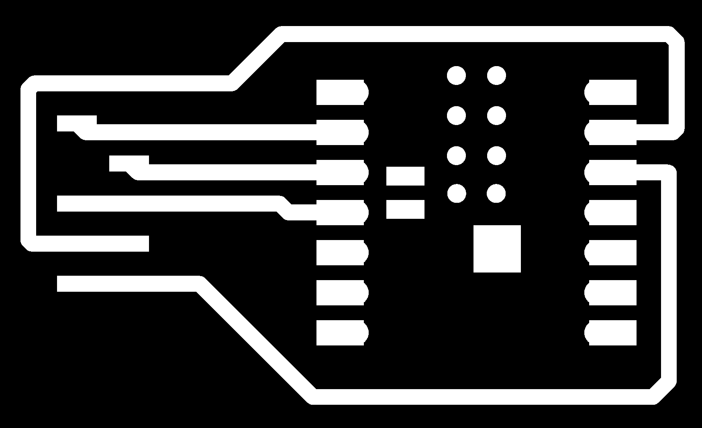
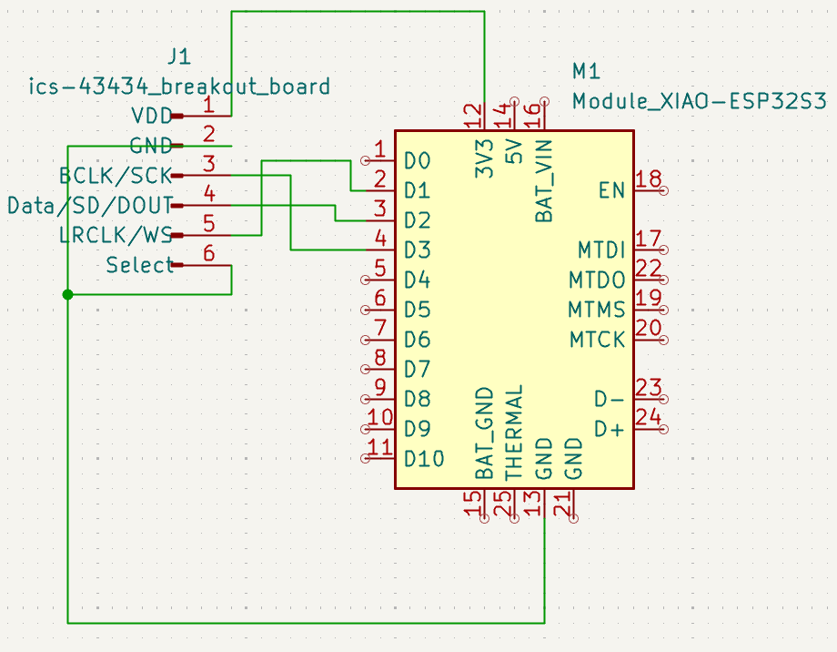

# bird_ai_pcb
Xiao ESP32-C6 with ICS-43434 PCB , RTSP streaming for BirdNet recognition

## PCB schematic

## PCB board

## Kicad files , gerber & PNG

[/kicad_files](/kicad_files)

[/geber_files](/geber_files)

[/png_engrave_file](/png_engrave_file)

Cut out board file image

Engrave trace file image

### Schematic

LRCLK / WS - D1
SD (DOUT) - D2
BCLK / SCK - D3

I didn't find the ICS-43434 component so I create my own 6 pin connector

### Board

I didn't find the correct Xiao ESP32-C6 footprint I use a similar footprint. This need to be improved to allow battery connection for a future solar-powered version.

## Fabrication process

Milling process of the FR1 board with a Roland SRM CNC machine.

Result

<video width="640" height="360" controls>
  <source src="https://github.com/lhanneus/bird_ai_pcb/raw/refs/heads/main/doc_images/milling.mp4" type="video/mp4">
  Your browser does not support the video tag.  
</video>

And laser engraving of the circuit with an Xtool F1 ultra.

video1

<video width="640" height="360" controls>
  <source src="https://github.com/lhanneus/bird_ai_pcb/raw/refs/heads/main/doc_images/laser_engraving.mp4" type="video/mp4">
  Your browser does not support the video tag.  
</video>

video2

<video width="640" height="360" controls>
  <source src="https://github.com/lhanneus/bird_ai_pcb/blob/main/doc_images/laser_engraving.mp4" type="video/mp4">
  Your browser does not support the video tag.  
</video>

video3

<video controls width="640">
  <source src="https://github.com/lhanneus/bird_ai_pcb/raw/refs/heads/main/doc_images/laser_engraving.mp4" type="video/mp4">
  Your browser does not support the video tag.
</video>

Xtool F1 ultra parameters were 100% power IR laser. Engraved between 20 to 30 passes.

Result of the board engraved.

Soldered and stuff with the Xiao ESP32-C6 & ICS-43434 PCB components

## Box

Metal box is really important. The wifi emitted by the esp32 is massively disturbing the mems microphone. 

Drill 3 holes in the metal box:
- one for the external antenna connector
- one for the USB c cable for power supply
- one on the backside for microphone sound capture. Microphone opening is on the opposite side of the pcb

## Audio Samples result

## Upload the code

The following lines ensure it's the external wifi antenna that is used.

'''TO BE DONE'''

## Future Improvement

1. Reduce PCB size
2. Connect battery Xiao connector and use solar power & 18650 standard battery with associated controlers

## Licence

Licences CC BY-NC-SA 4.0 : https://creativecommons.org/licenses/by-nc-sa/4.0/

Author : Luc Hanneuse

Any commercial application must be discussed & accepted by the Author.